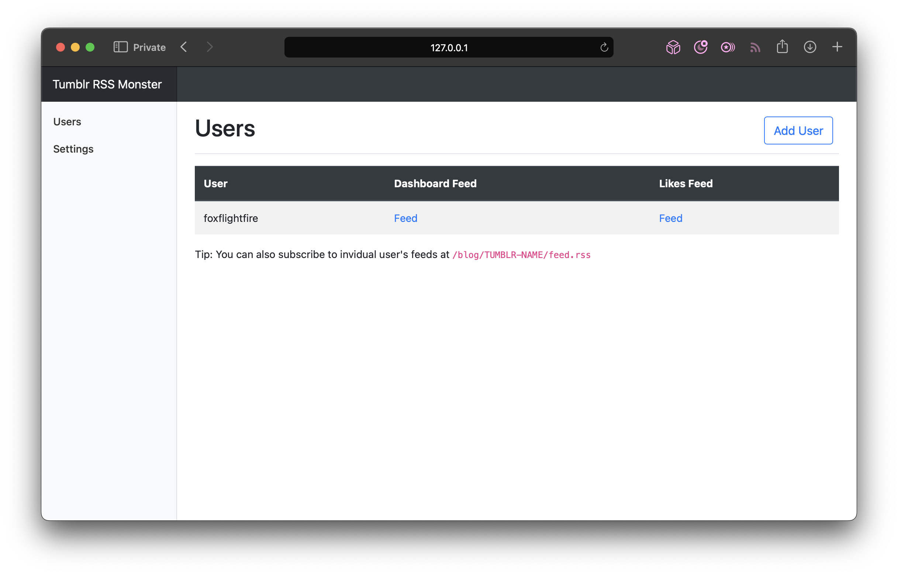

# Tumblr RSS Monster

<p align="center">
  
</p>

Hey! So, you want to read your tumblr feeds in your RSS reader, huh? You want to be able to grab your dashboard or share your liked posts with someone else or maybe follow a couple of blogs? Well this is the project for you.

Tumblr RSS monster is a bridge that connects to Tumblr via their API and generates you RSS feed goodness. Because it uses the API and is authenticated you'll be able to get feeds for private or NSFW blogs that normally require you to be logged in.

## What does it look like?



The hope is that you're not spending too much on admin screens so these pages have been designed to get you in, get you logged into tumblr, and then get the feed urls. The hope is that you won't need to pop in too often.

## Deploying

This project is deployed as a docker container.

```bash
> docker pull ghcr.io/nicolecomputer/tumblr-rss-monster:main
```

### Environemnt variables:

- `TUMBLR_CONSUMER_KEY`: Tumblr consumer key from [creating an application](https://www.tumblr.com/oauth/apps)
- `TUMBLR_CONSUMER_SECRET`: Tumblr consumer key from [creating an application](https://www.tumblr.com/oauth/apps)
- `STORAGE_ROOT`: Optional defaults to /data/

### Mounts:

You'll want to mount a folder that will persist between deploys.

- `/data`: location for database, cache, and cookie storage

### Ports

This project exepcts the container's port of `6969` to be forwarded to your destination port.

## Usage

After installing and starting navigate to http://127.0.0.1:6969 You'll be able to login as a tumblr user and see the rss feeds that have been generated.

## Development

Tumblr-Dashboard-RSS is written in Typescript. To get started you need to:

- Clone the project
- Install the dependencies (`yarn install`)
- Create a [.env](https://www.npmjs.com/package/dotenv) file in the project root with the name environment variables docker expects
- Set `TUMBLR_CONSUMER_KEY`, `TUMBLR_CONSUMER_SECRET` in the .env file
- Start the project (`yarn start`)

This will start a process that will watch the source code (located in `src/`) for changes, compile those changes from typescript to javascript, output the javascript to `dist/` and run the program.

There's a `.devcontainer` setup in this project to make things easier to setup. You can get started quickly with either [VSCode's remote container support](https://marketplace.visualstudio.com/items?itemName=ms-vscode-remote.remote-containers) or [Github's codespace](https://github.com/features/codespaces).

## Credits

Tumblr RSS Monster started life as [tumblr-dashboard-rss](https://github.com/meyer/tumblr-dashboard-rss) by [Meyer](https://github.com/meyer) and then morphed into this monster by [NicoleComputer](https://github.com/meyer).

`Be nice.`
